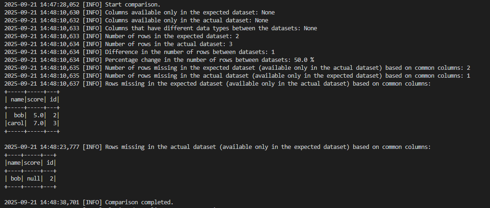

# Dataset Comparator

This repository provides the `DatasetComparator` class, designed for comparing two PySpark datasets (DataFrames). The comparator helps ensure data consistency during the migration from an on-premises data warehouse to a cloud-based environment by performing checks for schema differences, row count discrepancies, and value mismatches.


## Features

- **Schema comparison:** Identify columns only in one dataset or with mismatched types.
- **Row count comparison:** Compare the number of records between datasets.
- **Value comparison:** Detect rows present in one dataset but missing in the other.
- **Flexible input:** Datasets can come from CSV files, database tables, ...


## Project Structure

- **src/** – Contains the Dataset Comparator source code.
- **test/** – Contains unit tests.


## Setup

1. Clone the repository:  
   ```bash
   git clone https://github.com/RzeznAnita/dataset-comparator.git
   cd dataset-comparator
   ```

2. Create and activate a virtual environment:
   ```bash
   python -m venv venv
   source venv/Scripts/activate
   ```

3. Install the dependencies:
   ```bash
   pip install -r requirements.txt
   ```


## Run DatasetComparator
To run the `DatasetComparator`, follow these steps:

1. Open the file `src/run_comparison.py`.
2. Initialize the datasets.
   The DatasetComparator requires two PySpark DataFrames:
   - expected_df – the reference dataset to compare against
   - actual_df – the dataset to be validated

   They can be initialized in different ways, for example, by reading from CSV, JSON, or Parquet files, or by querying databases:
   
   ```python
   expected_dataset = spark.read.csv("data/expected.csv", header=True, inferSchema=True)
   actual_dataset = spark.read.csv("data/actual.csv", header=True, inferSchema=True)
   ```

3. Run the pipeline using the command:

    ```bash
    python -m src.run_comparison
    ```

4. The comparator returns the comparison results in the form of logs:
   

    Additionally, the comparator returns the result as a dictionary, which can be further processed - for example, saved to a file or exported as a DataFrame for further analysis.


## Run Tests

Unit tests can be run with:

```bash
pytest tests/test_comparator.py
